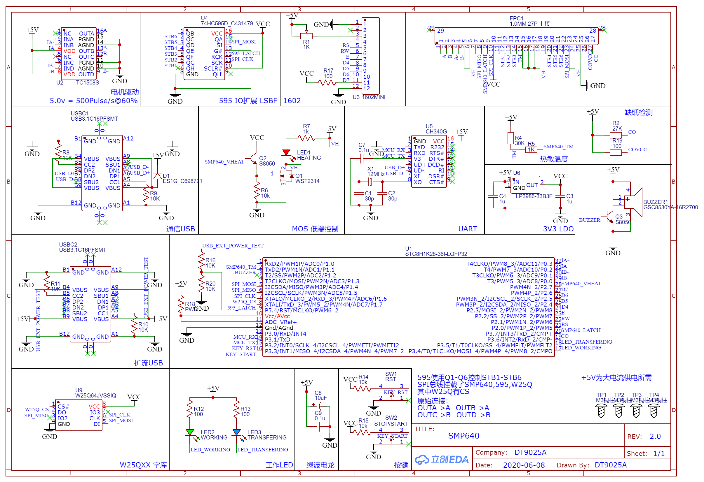

# SMP640-Printer
基于STC8的SMP640打印头驱动

板子画的垃圾, 就不放了

没做灰度, 只支持单色, 内存不够

有过热 / 缺纸检测

之后会加字库进去, 支持发送文字打印

做喵喵机之类的得换方案, 摸了

现在支持了一些ESC/POS指令

| 指令   |
| ------ |
| ESC @  |
| ESC J  |
| ESC d  |
| GS v 0 |

可以打上GP-58N驱动打印, 19200bps流畅打印

---

电路图在这

